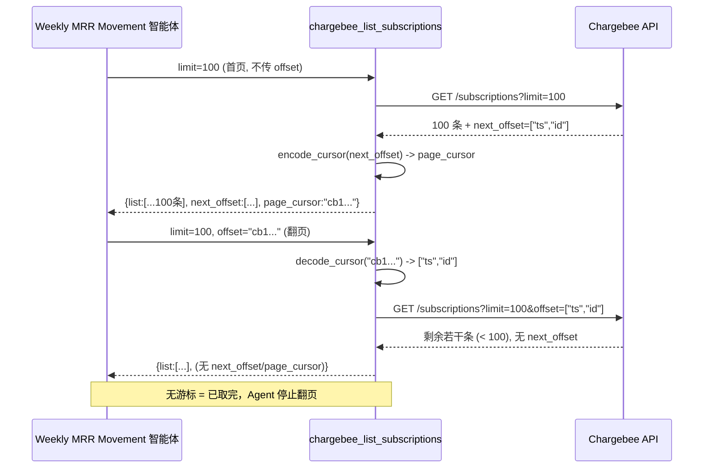
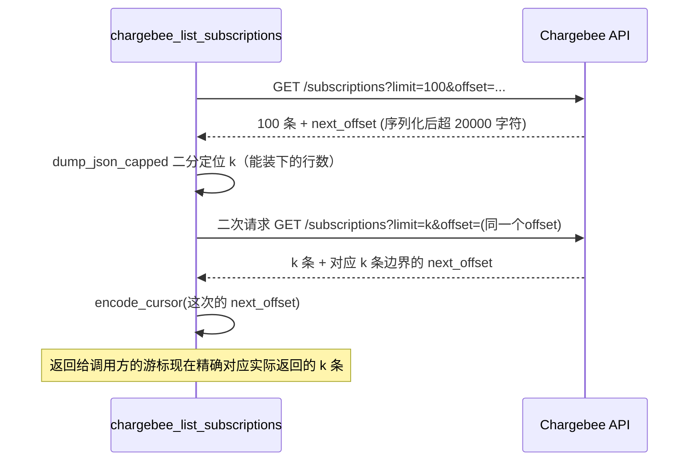

# PRD-17977 · [Bug] Chargebee MCP pagination broken

工单: https://app.clickup.com/t/86e3227xy
仓库: https://github.com/MSPbotsAI/chargebee-mcp@main (26950f5)
工作分支: dev01.mbagent/PRD-17977
状态: 在途（待推送后回填冻结 sha）

## 需求理解

一句话：Chargebee MCP 不支持分页——超过 100 条后取不到剩下的数据，导致 Weekly MRR Movement 智能体（sopId 281）跑不出完整周期的账单/订阅数据。

复述：Chargebee MCP 的 5 个列表类工具（`chargebee_list_customers` / `_list_customer_contacts` / `_list_subscriptions` / `_list_invoices` / `_list_transactions`）每次最多返回 100 条，并在响应里带一个 `next_offset` 游标供翻页。但 `next_offset` 是 Chargebee 原样返回的一个两元素数组（例如 `["1666285190000","41937694"]`），而工具的 `offset` 入参类型是纯字符串——不管把这个数组原样传回、转成 JSON 字符串传回、还是只传数组里的一个元素，全部失败（前两种在到达 Chargebee 之前就被 MCP 框架/Pydantic 拒绝，第三种能通过校验但被 Chargebee 用 HTTP 400 拒绝）。结果是任何超过 100 行的 Chargebee 查询都只能拿到第一页，第 101 行往后永远拿不到。这个缺陷是本次唯一目标；用工具自动一次性拉完整结果集（工单 Expected Result 里的另一种出路）是否也要做，取决于 OQ-2，本设计暂不假定要做。

Sources: description(2026-09-01 提交) + 14 条 comment（含 2026-09-01 11:46 UTC 定稿分析 id 90170247158457、2026-09-08 Kaka 要求重做 id 90170249491826）· 代码只读核实：`src/chargebee_mcp/tools/{customers,subscriptions,reports}.py`、`src/chargebee_mcp/tools/_common.py`、`src/chargebee_mcp/_json.py`、`src/chargebee_mcp/api_client.py`（均为 `chargebee-mcp@main` 26950f5）· wiki：`ProductDocs` 未覆盖——`wiki find "MRR Movement" / "pagination" / "chargebee"` 均无命中此工具（唯一命中 `ProductDocs/_connector-fields.md` 讲的是 Connector Library 配置表单里的凭据字段，与本单说的“Chargebee MCP 分页”是完全不同的模块），这是一个内部 AI Agent 平台工具的缺陷，不在面向客户的产品事实库范围内。

## 现状（每条断言带 path:line）

- 5 个列表工具的 `offset` 入参类型均为 `str | None`：
  - `src/chargebee_mcp/tools/customers.py:24`（`chargebee_list_customers`）
  - `src/chargebee_mcp/tools/customers.py:190`（`chargebee_list_customer_contacts`）
  - `src/chargebee_mcp/tools/subscriptions.py:30`（`chargebee_list_subscriptions`）
  - `src/chargebee_mcp/tools/reports.py:24`（`chargebee_list_invoices`）
  - `src/chargebee_mcp/tools/reports.py:74`（`chargebee_list_transactions`）
  - 描述文案统一来自 `src/chargebee_mcp/tools/_common.py:17-22`（`OFFSET_DESC`），写明“cursor-based … pass through a next_offset you already retrieved”，但没有任何代码把返回的 `next_offset` 转换成这个 `str` 类型能接住的形态。
- `next_offset` 本身不是这个仓库生成的，是 Chargebee API 响应体里的原始字段，全链路透传、未做任何处理：`src/chargebee_mcp/api_client.py:129-130`（`get()` 直接把 Chargebee 响应体原样返回）、`:181-187`（`_parse_body` 只做 `resp.json()`，不改写字段）。工具函数里也只是把 `client.get(...)` 的返回值直接交给 `dump_json_capped`（如 `subscriptions.py:66-67`），没有对 `next_offset` 做任何转换。
- 唯一处理响应体的地方是裁剪，`src/chargebee_mcp/_json.py:18-61`（`dump_json_capped`）：当序列化后超过 `MAX_CHARS=20000`（`_json.py:11`）时，对最大的那个 list 字段做二分截断（`:33-52`），但**同级键原样保留**——包括 `next_offset`。也就是说，被裁掉的那部分数据对应的游标，和裁剪后实际返回的最后一行不是同一个位置：调用方按这个游标翻页会静默漏行，而不是报错。这是本单描述之外、代码走查发现的第二个独立缺陷（沿用 2026-09-01 定稿分析里的判断，OQ-3 与此相关）。
- 依赖库层面：五个工具都通过 FastMCP（`mcp` 包，`uv.lock` 锁定 `mcp[cli]>=1.9.0,<2.0.0`）声明参数类型。2026-09-01 的定稿分析在本机 in-process 复现过，判定其参数预解析逻辑（`func_metadata.py` 内 `isinstance(data_value, str) and field_info.annotation is not str` 分支）会把“看起来像 JSON 数组的字符串”提前转换成 Python `list`，导致 Pydantic 用 `str` 类型接收时必然拒绝——工单描述的三种尝试方式（传数组、传数组的 JSON 字符串、传单个元素）分别对应“直接被拒”“被预解析成 list 后同样被拒”“通过校验但 Chargebee 侧 400”这三种失败模式，逐条吻合。**本轮未重新在本机复现这一步**（第三方依赖内部行为，`uv.lock` 核对显示 `c79e3ec..26950f5` 之间 `mcp` 版本未变，见下一条），沿用该结论；若不成立需重做本节与技术设计第 1/3/4 节。
  - 已核实：`git diff c79e3ec 26950f5 -- uv.lock` 无变化，本仓在两次设计之间没有升级任何依赖版本，唯二两次提交（`26950f5` 启用 stateless HTTP、`1afa8e2` 修 `cancel_subscription` 的枚举）改的是同一批文件里的其它参数（新增 `CancelOption`/`CreditOption` 等 `Literal`、丰富了几处 docstring），**没有改动 `offset` 参数的类型或分页相关逻辑**，只是把行内的 `OFFSET_DESC` 字符串字面量抽成了 `_common.py` 里的常量——2026-09-01 定稿分析里引用的 `subscriptions.py:24-26` 等行号已随之整体下移，本文档引用的都是重新核对过的当前行号。
- 该仓库远端只有 `main` 一个分支（`git ls-remote --heads origin` 本轮实测只返回 `main`），没有 INT，也没有任何 `dev01.mbagent/PRD-17977` 分支——本次设计是在 `main` 上新建的该分支。
- 门禁：`tests/test_tools.py`、`tests/test_middleware.py` 两个测试文件，用 `pytest-asyncio` + FastMCP 的 `list_tools()` 做无网络的 schema 快照测试；`grep -rn "offset" tests/` 无命中，当前完全没有分页相关的测试覆盖。

## 产品设计

### 目标 / 非目标

- 目标：Chargebee MCP 的 5 个列表工具支持端到端分页——调用方能够把某次响应里拿到的分页信息原样传回 `offset` 参数，成功取到下一页，直到把结果集取完；裁剪场景下游标与实际返回的行保持一致，不出现静默漏行。
- 非目标（本次不做，需求方在 groom 时确认是否要转正为目标——见 OQ-2）：
  - 工具内部自动循环翻页、一次性把“完整结果集”返回给调用方（工单 Expected Result 里的选项 b）。这与现有单次响应 20000 字符上限直接冲突，且需要另外设计“结果集太大时怎么办”（聚合 / 落附件 / 提高上限），范围明显更大。
  - 五个工具之外的其它列表型 Chargebee 资源（本仓当前只暴露这 5 个列表工具，其它资源本来就不在这个 MCP 的范围内，见仓库 README「Scope」一节）。
  - 对已经发生的历史截断数据做补偿或重跑（本次只保证之后的调用行为正确）。

### 验收标准（AC1–AC10）

- AC1: Given Weekly MRR Movement 智能体调用 `chargebee_list_subscriptions`（或 invoices / transactions / customers / customer_contacts 中任一个）首次翻页且结果集超过 100 条，When 把该次响应里返回的分页游标原样传回下一次调用的 `offset` 参数，Then 该调用被工具与 Chargebee 双方接受（不再出现 `Input should be a valid string` 校验错误，也不再出现 Chargebee `offset: wrong format` 的 400），并返回第 101–200 条数据。
- AC2: Given 5 个受影响工具中任意一个的结果集是页大小的整数倍且还有更多数据，When 沿着每次响应返回的游标连续翻页直到某次响应不再带游标，Then 能取到全部行、不重复不遗漏，且最后一页明确标识“没有更多”（不返回游标，或返回可判定为空的值，与非空游标能区分开）。
- AC3: Given 结果集不超过 100 条（一页取完），When 调用任一受影响工具，Then 响应中不带下一页游标（或明确为空），首页行为与今天完全一致，不因本次改动而变化。
- AC4: Given 某次响应因超过 20000 字符被截断，When 客户端拿这次响应里的游标去请求下一页，Then 取到的是本次响应**实际返回的最后一行**的下一行——不会因为裁剪而跳过或重复任何一行。
- AC5: Given 调用方传入一个格式错误或被篡改、既不是本工具签发也无法被识别的游标字符串，When 调用任一受影响工具，Then 返回结构化错误（`invalid_argument`、不可重试），不 500、不把 Chargebee 的裸错误报文原样透传导致调用方无法判断怎么处理。
- AC6: Given 两个不同租户（不同的 `X-Chargebee-Site` / `X-Chargebee-Api-Key`）各自分页，When 用租户 A 某次响应拿到的游标发起调用，Then 该游标只能取到租户 A 自己站点下的下一页数据；即使游标本身不做租户绑定，请求头决定的站点边界必须仍然生效，不能因为传了游标就跨到另一个站点的数据。
- AC7: Given 现有调用方（未升级的 SOP/prompt）历史上只取首页、从不使用分页，When 本次改动上线后不带 `offset` 调用任一工具，Then 首页返回值的既有字段（含原始 `next_offset`）不被删除或改名，行为与今天一致。
- AC8: Given 调用方对 `offset` 传入空字符串或完全不传，When 调用任一受影响工具，Then 从第一页开始正常返回，不报错（`OFFSET_DESC` 已注明首页调用必须允许不传 `offset`，这条不能被本次改动破坏）。
- AC9:（需要 Chargebee test site 凭据，不能用生产 key 验证）Given 使用 Chargebee 测试站点的真实凭据，When 对 `chargebee_list_subscriptions` 请求一个超过 100 条的真实结果集并连续翻页，Then 端到端从 Chargebee 真实 API 拿到完整数据，不是靠 mock 断言通过。
- AC10: Given Weekly MRR Movement 智能体（sopId 281）对 2026-08-24→2026-08-30 这类周期重跑，且该周期的 Chargebee 数据超过 100 行，When 智能体按新的分页方式翻页，Then 能拿到该周期完整数据，不再只有前 100 行（对应工单最初的复现步骤，作为端到端回归）。

### Open Questions

- OQ-2 [已假设]：工单 Expected Result 给了两条出路——(a) 接受回传游标做调用方驱动分页；(b) 工具自动翻页、直接返回完整结果集。两者不等价，且 (b) 与现有 20000 字符响应上限直接冲突（真正“完整”的结果集通常装不进一次工具返回，需要额外决定超限时给什么——聚合 / 落附件 / 提高上限）。本设计假设按 (a) 实现。若 groom 确认要 (b)，第 4/5/6/9 节需要重做。
- OQ-3 [已假设]：为了让游标能被参数层原样送达，方案在响应里可能新增一个字段（不透明游标），且要处理“裁剪时游标必须对得上实际返回的行”。若已有 SOP 提示词按现有响应形状写死了读法，新增字段本身是向后兼容的（旧 `next_offset` 保留不删，见 AC7），但如果游标的**取值**格式变化（不再是那个两元素数组的字面量），依赖“自己解析游标内部结构”的调用方会受影响。本设计假设没有调用方在解析游标内部结构（只做“原样传回”），若不成立需要在 groom 时确认。
- OQ-4 [不阻塞]：AC9/AC10 依赖 Chargebee 测试站点凭据，本仓库 README「Known Gaps」已经记录过“写操作只能用测试站点、不能用生产 key”的同类限制——测试站点凭据由谁提供、什么时候能拿到，留给 groom 确认，不阻塞设计本身。

## 技术设计

### 结论

把 5 个工具的 `offset` 入参类型从 `str | None` 放宽为 `str | list[str] | None`，同时吃住 MCP 参数预解析产生的 list 和调用方直接传字符串两种输入；工具内部把收到的 offset（无论哪种形态）规整成 Chargebee 需要的原始请求参数，成功后把 Chargebee 返回的 `next_offset`（同样可能是 list）编码成一个不会被 MCP 参数预解析误判成 JSON 的不透明字符串，随原始 `next_offset` 一起放进响应体（新增字段，旧字段不删，见 AC7）；`dump_json_capped` 遇到需要裁剪的响应时，改为按二分定位出真正能装下的行数 `k` 后用相同 `offset`、`limit=k` 重新请求一次，让 Chargebee 自己返回的游标精确对应这 `k` 行，而不是本地切片后继续沿用原游标（解决 AC4／OQ-3 的裁剪-游标一致性问题）。为什么这样最省：不用改 `api_client.py` 的传输层，也不用改 Chargebee 侧行为，改动全部收敛在“工具层怎么声明参数类型、怎么编解码游标、裁剪时怎么补一次请求”这三处。

### 现有实现定位

| 位置 | 负责什么 |
|---|---|
| `src/chargebee_mcp/tools/_common.py:17-22`（`OFFSET_DESC`） | 5 个工具共用的 offset 参数说明文案，本次要同步更新 |
| `src/chargebee_mcp/tools/customers.py:22-61`（`chargebee_list_customers`） | 组 `params` 字典（含 `offset`）后调用 `client.get("/customers", ...)` |
| `src/chargebee_mcp/tools/customers.py:184-204`（`chargebee_list_customer_contacts`） | 同上，`client.get(f"/customers/{customer_id}/contacts", params={"limit": ..., "offset": offset})`，写法和其它 4 个工具略有不同（内联 dict 而不是先组 `params` 再 update filters），改动时要留意 |
| `src/chargebee_mcp/tools/subscriptions.py:26-69`（`chargebee_list_subscriptions`） | 同 customers 的写法 |
| `src/chargebee_mcp/tools/reports.py:20-69` / `:71-120`（`chargebee_list_invoices` / `chargebee_list_transactions`） | 同上，两个工具在同一个文件里，写法一致 |
| `src/chargebee_mcp/api_client.py:129-133`（`ChargebeeClient.get/post`） | 请求发出前只做 `_clean_params`（丢 None），响应只做 `resp.json()`，不适合在这里做游标编解码——它不知道“这是分页游标”，只知道任意 `params`/响应体 |
| `src/chargebee_mcp/_json.py:18-61`（`dump_json_capped`） | 唯一处理响应体裁剪的地方，纯同步无 IO；本次要给它加一个“裁剪发生时的替代产出”的钩子，但不能让它自己发起网络请求（职责越界） |
| `tests/test_tools.py:16-27`（`EXPECTED_REQUIRED`） | 现有的 schema 快照测试逐工具写死了必填参数集合，改动 `offset` 类型后要确认这个快照仍然通过（`offset` 本来就不是必填，预期不受影响，但要实测） |

相邻同类实现：5 个工具的 `offset` 处理方式几乎一致（都是 `params: dict` 里放一个 `offset` 键），改动可以在 `_common.py` 提供一个共用的规整函数，5 个工具调用点统一改法，不需要各写各的。

### 方案选型

| 方案 | 做法 | 优点 | 代价 | 结论 |
|---|---|---|---|---|
| A：只放宽 offset 类型 | `offset: str \| list[str] \| None`，工具内部把 list 转回 Chargebee 需要的形态即可，响应不新增字段 | 改动最小，5 个文件 + `_common.py` | AC4/OQ-3 的裁剪-游标不一致问题仍然存在（裁剪场景仍会静默漏行） | 不选：只解决了工单描述的表层现象，留了一个后续会被单独发现的缺陷 |
| B：放宽类型 + 不透明游标 + 裁剪时二分重新请求（推荐） | 在 A 的基础上：响应新增一个不透明游标字段（`cb1.` 前缀 + base64url，字符集里没有 `[`、`{`、`"`，MCP 预解析不会误判成 JSON）；`dump_json_capped` 裁剪发生时不再本地切片延用原游标，而是二分出能装下的行数 `k` 后用同一 `offset`、`limit=k` 对 Chargebee 重新请求一次，拿它自己返回的游标 | 根治两个独立缺陷（参数类型 + 裁剪一致性），且不透明游标结构上不可能再被预解析破坏 | 裁剪发生时多一次到 Chargebee 的请求（非裁剪路径完全不受影响，多数调用不会触发裁剪）；响应新增字段是一次显式的契约变更（见 OQ-3） | **选此方案** |
| C：工具内部自动翻页、一次性返回完整结果集 | 循环调用 Chargebee 直到拿完，返回时自己处理超过 20000 字符的情况（聚合/落附件/提高上限） | 调用方完全不用管分页 | 与现有响应上限设计冲突，需要新设计“太大时给什么”，范围明显更大；对应 OQ-2 选项 (b)，需产品先确认 | 不选（本次），OQ-2 澄清后如需要，作为后续迭代单独立项 |

### 改动清单

- `src/chargebee_mcp/tools/_common.py` [改] —
  - `OFFSET_DESC`（:17-22）改写为同时说明「可以传一个不透明游标字符串（从上次响应的分页字段原样复制），也兼容直接传回上次响应里的原始 `next_offset`」；
  - 新增两个共用函数：`encode_cursor(raw_next_offset: str | list[str] | None) -> str | None`（编码成 `cb1.` + base64url）与 `decode_cursor(offset: str | list[str] | None) -> str | list[str] | None`（把调用方传入的值规整成 Chargebee 需要的原始形态：不透明游标要先解码，`list[str]` 直接透传，纯字符串且不是不透明游标格式的按原样透传保持向后兼容）。
- `src/chargebee_mcp/tools/customers.py` [改] — `chargebee_list_customers`（:22-61）与 `chargebee_list_customer_contacts`（:184-204）的 `offset` 入参类型改为 `str | list[str] | None`；调用 `client.get` 前用 `decode_cursor` 处理传入值；拿到结果后用 `encode_cursor` 把响应里的 `next_offset` 编码进新字段，原 `next_offset` 保留。
- `src/chargebee_mcp/tools/subscriptions.py` [改] — `chargebee_list_subscriptions`（:26-69）同上。
- `src/chargebee_mcp/tools/reports.py` [改] — `chargebee_list_invoices`（:20-69）、`chargebee_list_transactions`（:71-120）同上。
- `src/chargebee_mcp/_json.py` [改] — `dump_json_capped`（:18-61）新增可选参数 `on_truncate: Callable[[int], Any] | None`：裁剪逻辑二分找到能装下的行数 `k` 后，若提供了 `on_truncate` 就调用 `on_truncate(k)` 换取替代 payload（由调用方——各 tools 文件——在这个回调里用 `limit=k` 对 Chargebee 重新请求），不提供则保留现有本地切片行为（向后兼容，其它调用方不受影响）。**这个函数本身继续保持纯同步、不做网络 IO**，网络请求由回调的实现方（各 tools 函数）负责，职责边界不越过 `_json.py`。
- `tests/test_pagination.py` [新增] — 分页专项测试（用例见「测试策略」）。
- `tests/test_tools.py` [不改，仅重跑确认] — 现有 schema 快照测试预期仍然通过（`offset` 非必填参数，放宽类型不影响 `required` 集合）。
- 未在仓库中找到需要新增的 DB/迁移文件——这个服务是无状态的 MCP 适配层，不持有自己的存储。

### 数据与接口契约

**API（MCP 工具 schema 变更，5 个工具一致）**：

- 请求：`offset` 参数类型由
  ```json
  {"offset": {"type": "string", "nullable": true}}
  ```
  放宽为
  ```json
  {"offset": {"anyOf": [{"type": "string"}, {"type": "array", "items": {"type": "string"}}], "nullable": true}}
  ```
  调用方三种传法都要能工作：不传（首页）、传上次响应里的不透明游标字符串（推荐）、传上次响应里原始 `next_offset` 数组（向后兼容，兼容 OQ-3 里假设的"没有调用方解析游标内部结构"但确实有调用方原样保存过整个响应、想直接把 `next_offset` 传回来这种用法）。

- 响应：以 `chargebee_list_subscriptions` 为例，新增字段前后对比：

  改动前：
  ```json
  {"list": [...], "next_offset": ["1666285190000", "41937694"]}
  ```

  改动后：
  ```json
  {"list": [...], "next_offset": ["1666285190000", "41937694"], "page_cursor": "cb1.WyIxNjY2Mjg1MTkwMDAwIiwiNDE5Mzc2OTQiXQ"}
  ```
  最后一页（无更多数据）：`next_offset` 与 `page_cursor` 均不出现在响应体里（Chargebee 自己在没有下一页时就不返回 `next_offset`，本服务原样保留这个约定，不新造一个"空字符串"当作哨兵）。

- 错误码：非法/无法解码的 `page_cursor` 或不认识的 `offset` 形态 → 复用现有 `error_envelope("invalid_argument", ..., False)`（`_json.py:76-77`），不新增错误码分类。

- 向后兼容：老客户端只读 `list` 和 `next_offset`，两个字段行为不变；新客户端可以选择读 `page_cursor` 简化传参。没有客户端需要迁移，`page_cursor` 是纯增量字段。

- DB/迁移：无——本服务无状态，不涉及数据库。

- 事件/消息：无——本服务不发布事件。

### 关键流程时序



裁剪场景（AC4）：



### 非功能

- **幂等与并发**：`GET` 天然幂等；同一个 `page_cursor` 被重复使用是安全的（只要 Chargebee 那边数据没变，重复请求得到同一批数据）。并发多个翻页请求之间互不影响——本服务不维护跨请求的分页状态，游标本身就是全部状态（stateless，和 26950f5 那次"Enable stateless HTTP"的既有方向一致）。
- **性能**：正常路径（未触发裁剪）不增加任何请求；裁剪路径（预计发生在单行数据体积大、如订阅/发票明细字段多的场景）从 1 次 Chargebee 请求变成 2 次，多出的延迟是一次到 Chargebee 的 GET（P95 参考现有 `_TIMEOUT.read=30s`，实际观察需要在自测阶段量化）。二分次数是 `log2(100)≈7` 次本地字符串序列化比较，可忽略。
- **安全**：`page_cursor` 只是原始 `next_offset` 的编码形式，不携带任何服务端签发的密钥/签名，也不做租户绑定——多租户隔离完全依赖 `AUTH_MODE=gateway` 下每次请求携带的 `X-Chargebee-Site` / `X-Chargebee-Api-Key`（`server.py` 的 contextvar 机制，`api_client.py` 头部第 16-20 行注释已说明这是隔离依据），所以 AC6 验的其实是"游标不能绕开这个既有隔离"而不是"游标自己要做隔离"——这条要在测试策略里显式验证一次，不能只推导不测。日志：不打印 `page_cursor` 或 `next_offset` 的原始值到日志（本服务当前没有单独的日志基础设施，`docker-compose.yml`/`Dockerfile` 未见集中日志配置，属于本仓现状，不在本次改动范围内新增）。
- **多租户隔离**：见上一条，机制不变，本次不新增隔离维度，只是新增一个不影响隔离边界的响应字段。
- **可观测**：本次改动不新增日志/指标（现状本仓没有相关基础设施，超出本单范围）；`dump_json_capped` 新增的裁剪时二次请求建议在实现阶段视情况加一行 debug 级别打印（是否发生了裁剪补偿请求），具体做法留给实现，因为本仓目前没有统一的日志约定可以照抄。

### 上线与回滚

- 无 feature flag——这是一个 MCP 工具 schema 变更，粒度是"发布新版本的 chargebee-mcp 服务"，不支持按租户灰度（`AUTH_MODE=gateway` 下所有租户共享同一个部署）。
- 发布顺序：该仓库只有 `main` 一个分支、没有 INT（见「现状」），按 `legs/dev.md` S6 的规则，合入目标需要人决定（建 INT 分支，还是直接 `main` + PR）——这条留给开发棒执行时确认，设计阶段不假设。
- 回滚：新增的 `page_cursor` 字段是纯增量，回滚版本即可恢复旧行为；`offset` 参数类型放宽是超集（`str | list[str] | None` 能接住放宽前所有合法输入），回滚不会让存量调用方出现新的失败。风险最高的是"裁剪时二次请求"这条路径，如果二次请求引入非预期行为（例如 `k` 算错导致漏行），影响范围只限于触发裁剪的大结果集查询，其它路径不受影响，可以先只回滚 `_json.py` 这一处改动而保留 offset 类型放宽（两者在改动清单里是可拆分的）。

### 测试策略

- 单测覆盖（对应 `tests/test_pagination.py` 新增）：
  - AC1/AC2：mock `ChargebeeClient.get` 连续返回两页（第二页无 `next_offset`），断言 `page_cursor` 能被 `decode_cursor` 还原成第一页的 `next_offset`，且第二次调用时 `client.get` 收到的 `offset` 就是这个还原值。
  - AC3：mock 单页无 `next_offset`，断言响应体里没有 `page_cursor` 键。
  - AC4：mock 一页数据序列化后超过 20000 字符，断言触发了二次请求（`client.get` 被调用 2 次）且第二次的 `limit` 小于第一次。
  - AC5：传入解不开的 `page_cursor`（如随手拼的字符串），断言返回 `error_envelope("invalid_argument", ...)` 而不是抛异常。
  - AC7：不传 `offset` 调用，断言响应体仍含原始 `next_offset` 字段（未被本次改动删除或改名）。
  - AC8：传 `offset=""` 与不传 `offset` 两种，断言效果一致、都不报错。
  - `tests/test_tools.py` 现有快照测试重跑，确认 `EXPECTED_REQUIRED` 与 annotations 断言仍然通过。
- 集成/手工测试（AC6、AC9、AC10，需要真实 Chargebee 凭据，不能用生产 key，见 OQ-4）：
  - AC6 需要两个不同的 Chargebee 测试站点凭据分别请求，人工核对游标不跨站点生效——本仓当前只有生产 API key（见「Known Gaps」），测试站点凭据到位前这条只能记「未执行 · 需要 Chargebee 测试站点凭据」。
  - AC9/AC10 同理，需要测试站点里造出超过 100 条的订阅/发票数据，本设计阶段无法确认测试站点是否已有这个量级的数据，留给开发棒在自测阶段核实。
- 回归面：5 个工具全部改了 `offset` 类型和响应体新增字段，`tests/test_tools.py` 的 schema 快照测试覆盖了全部 10 个工具（含未受本次改动影响的 `create_customer` / `update_customer` / `retrieve_*` / `cancel_subscription`），重跑一次即可确认没有波及无关工具。

### 工作量与拆分

- 粗粒度估算：1–2 人日（`_common.py` 编解码函数 + 5 个工具改法一致 + `_json.py` 裁剪回调，改动模式高度重复；不确定性主要来自 AC9/AC10/AC6 需要真实 Chargebee 测试站点凭据，若凭据不能及时拿到，这部分只能记「未执行」而不是拖慢主体交付）。
- 建议拆分：
  - 子任务 1：`_common.py` 编解码函数 + `_json.py` 裁剪回调机制 + 单测（AC4/AC5 相关），可独立验收。
  - 子任务 2：5 个工具接入编解码函数、更新 `OFFSET_DESC`、补 AC1/AC2/AC3/AC7/AC8 的单测，可独立验收。
  - 子任务 3（依赖测试站点凭据到位）：AC6/AC9/AC10 的手工验证，可能滞后于前两个子任务交付。

### 风险与依赖

- 风险：Chargebee 侧对 `offset` 参数实际接受的序列化格式（把两元素数组重新编码回请求参数时该是什么形态）本次设计未做真实调用验证——2026-09-01 的定稿分析也只在本机 in-process 复现了 MCP 参数预解析这一层，没有实测 Chargebee API 对"重新序列化后的 offset"的真实反应。这是实现阶段第一个要打通的环节，若 Chargebee 期待的格式与假设不同，`decode_cursor` 的实现细节需要相应调整，但不影响本设计的整体方案方向（不透明游标 + 类型放宽 + 裁剪补偿）。
- 依赖：Chargebee 测试站点凭据（AC6/AC9/AC10，见 OQ-4）——不是这次设计的阻塞项，但是开发棒能否把 AC9/AC10 从"未执行"变成"通过"的前提。
- 依赖：该仓库的合入目标（`main` 直接发布 vs 建 INT）需要人决定，见「上线与回滚」。

## 测试用例

（判定句见下，完整步骤见同目录 `PRD-17977.ac.json`）

- TC-CBM-001（AC1，自动）：Given 首页结果超过 100 条，When 把响应里的 `page_cursor` 传回 `offset` 再次调用，Then 返回值不再报参数校验错误、也不再被 Chargebee 拒绝，且拿到的是紧接首页之后的数据。
- TC-CBM-002（AC1，自动）：Given 同上场景，When 改用响应里原始 `next_offset`（而不是 `page_cursor`）传回 `offset`，Then 同样成功（向后兼容路径）。
- TC-CBM-003（AC2，自动）：Given 结果集恰好是页大小整数倍，When 连续翻页直到某次响应无游标，Then 累计取到的行数与总数一致、无重复无遗漏。
- TC-CBM-004（AC3，自动）：Given 结果集不超过 100 条，When 调用工具，Then 响应体不含 `page_cursor` / `next_offset`。
- TC-CBM-005（AC4，自动）：Given mock 一页数据使序列化结果超过 20000 字符，When 调用工具，Then 触发了二次请求，且返回的游标对应第二次请求的 `limit`，不是第一次未裁剪前的游标。
- TC-CBM-006（AC5，自动）：Given `offset` 传入一个无法被识别/解码的字符串，When 调用工具，Then 返回结构化 `invalid_argument` 错误，不抛未捕获异常。
- TC-CBM-007（AC6，手工，环境：需 Chargebee 测试站点×2）：Given 两个不同租户各自的凭据，When 用租户 A 的游标发起调用，Then 只能取到租户 A 自己站点的数据，不能取到租户 B 的。
- TC-CBM-008（AC7，自动）：Given 不传 `offset` 调用工具，When 检查响应体，Then 原始 `next_offset` 字段仍然存在且值不变（相对于本次改动前的行为）。
- TC-CBM-009（AC8，自动）：Given `offset=""`（空字符串），When 调用工具，Then 等价于不传，返回首页且不报错。
- TC-CBM-010（AC8，自动）：Given 完全不传 `offset`，When 调用工具，Then 返回首页且不报错（与 TC-CBM-009 分别验证两种"未提供"的输入形态）。
- TC-CBM-011（AC9，手工，环境：Chargebee 测试站点，不可用生产 key）：Given 测试站点里存在超过 100 条订阅数据，When 端到端连续翻页，Then 从真实 Chargebee API 拿到完整数据集。
- TC-CBM-012（AC10，手工，环境：Chargebee 测试站点或等效的可控数据集）：Given 复现工单原始场景（Weekly MRR Movement，某个超过 100 行的周期），When 智能体按新分页方式跑一遍，Then 拿到该周期完整数据，不再停在第 100 行。
- TC-CBM-013（AC5，自动，边界/异常）：Given `offset` 传入一个合法 JSON 数组字符串但内容是随意编造的（不是任何工具签发过的值），When 调用工具，Then 同 TC-CBM-006，返回 `invalid_argument`，不会被误当成合法游标转发给 Chargebee 造成非预期请求。
- TC-CBM-014（AC2，自动，异常/边界）：Given 翻页过程中中途换成另一个工具签发的游标（例如把 `chargebee_list_invoices` 的游标传给 `chargebee_list_subscriptions`），When 调用工具，Then 返回 `invalid_argument`（游标与工具/资源不匹配），不会静默返回错资源的数据或崩溃。
- TC-CBM-015（AC6，自动，安全/OWASP API1 越权锚点）：Given 同一个不透明游标字符串原样发给"另一个租户凭据"的请求（模拟跨租户重放该游标），When 调用工具，Then 请求头决定的站点边界生效，返回的是新租户凭据对应站点的数据（或该站点下该游标本就无效而报错），绝不会返回原租户站点的数据——这是本单的跨租户越权锚点用例，必须打真实的工具调用（后端），不能只看有没有暴露在 UI 上。

未覆盖的 AC：无——AC1–AC10 均至少有一条用例（AC1/AC2/AC5/AC6/AC8 各有 2 条）。

**`ticket_store.py validate` 当前会对 11 条 `type: auto` 用例各报一条「no tests -- allowed」的提示（退出码 1）**：设计阶段还没有实现代码，`tests` 数组必然是空的，这正是脚本自己判定为「允许，但要在旁边说明原因」的那类问题，不是本单缺 AC 覆盖或缺步骤——原因就是这一整段文字。这 11 条的 `notes` 字段已逐条写明「待实现」，dev 在红绿驱动实现时把对应的 `tests/test_pagination.py::test_*` 路径填回 `tests` 数组即可让 validate 转绿；4 条 `type: manual`（TC-CBM-007/011/012 + 无，实际是 3 条：AC6/AC9/AC10 各一条手工用例）已有 `steps`/`expect`/`result: untested`，不受这条提示影响。**这不算「验收标准变更」，用例的判定内容（GWT/AC 对应关系）一个字没改，改的只是"用什么手段执行"，属于技术设计范畴内的自由。**

## 自测

### 门禁

| 命令 | 结果 |
|---|---|
| `uv run pytest`（baseline，本次改动前，`git stash` 复核） | 16 passed |
| `uv run pytest`（final，本次改动后） | 28 passed |
| `tdd.py diff --from baseline --to final` | 退出码 0，无回归；12 条新增全部转绿 |
| `uv run ruff check .` | 15 条既有基线告警（`__main__.py`/`_json.py`/`config.py`/`server.py`/`customers.py`/`subscriptions.py` 的 E501 + `server.py` 一条 E731，均与本次改动的文件/行无关，未新增）；本次改动自己新增的 2 条（`_common.py` 导入顺序、`reports.py` 未使用的 import）已用 `ruff check --fix` 修掉，回归为 0 净增 |
| 类型检查 | 本仓未声明 mypy 门禁（`pyproject.toml` 无 `[tool.mypy]`），`tdd.py detect` 确认 `typecheck_cmd: null`，不适用 |

没有可 smoke 的 `dist/server.js`（本仓是 Python stdio/HTTP MCP 服务，非 mspack 应用）；`tests/test_middleware.py` 已经用 `starlette.testclient.TestClient` 真实构建过 HTTP app 并打 `/health`，等价于门禁内置的 smoke 覆盖，未额外起进程。

### 改动清单（与技术设计一致）

- `src/chargebee_mcp/_json.py`：把 `dump_json_capped` 内部的二分截断逻辑抽成纯函数 `fit_count`/`fits`（无行为变化，供 `_common.py` 复用，避免重复实现同一个二分查找）。
- `src/chargebee_mcp/tools/_common.py`：新增 `encode_cursor`/`decode_cursor`/`to_request_offset`/`InvalidCursorError`/`list_with_cursor`；`OFFSET_DESC` 同步更新措辞。
- `src/chargebee_mcp/tools/subscriptions.py`、`customers.py`（`chargebee_list_customers` 与 `chargebee_list_customer_contacts`）、`reports.py`（`chargebee_list_invoices` 与 `chargebee_list_transactions`）：5 个受影响工具的 `offset` 类型放宽为 `str | list[str] | None`，接入 `decode_cursor`/`list_with_cursor`。`chargebee_retrieve_subscription`/`chargebee_cancel_subscription`/`chargebee_create_customer`/`chargebee_retrieve_customer`/`chargebee_update_customer` 未改动。
- `tests/test_pagination.py`（新增）：12 条自动化用例，见下表。

### 用例矩阵

| 用例 | AC | 类型 | 结果 | 证据 |
|---|---|---|---|---|
| TC-CBM-001 | AC1 | auto | pass | `tests/test_pagination.py::test_page_cursor_round_trip_gets_page_two` |
| TC-CBM-002 | AC1 | auto | pass | `tests/test_pagination.py::test_raw_next_offset_passed_back_also_works` |
| TC-CBM-003 | AC2 | auto | pass | `tests/test_pagination.py::test_consecutive_pages_cover_full_set_no_gaps_no_dupes` |
| TC-CBM-004 | AC3 | auto | pass | `tests/test_pagination.py::test_single_page_has_no_cursor_fields` |
| TC-CBM-005 | AC4 | auto | pass | `tests/test_pagination.py::test_oversized_page_triggers_refetch_with_matching_cursor` |
| TC-CBM-006 | AC5 | auto | pass | `tests/test_pagination.py::test_garbage_offset_is_invalid_argument_not_a_crash` |
| TC-CBM-007 | AC6 | manual | 未执行 · 环境阻塞 | 需要两个 Chargebee 测试站点凭据，本轮环境没有，见下「未执行说明」 |
| TC-CBM-008 | AC7 | auto | pass | `tests/test_pagination.py::test_original_next_offset_field_preserved` |
| TC-CBM-009 | AC8 | auto | pass | `tests/test_pagination.py::test_empty_string_offset_is_first_page` |
| TC-CBM-010 | AC8 | auto | pass | `tests/test_pagination.py::test_omitted_offset_is_first_page` |
| TC-CBM-011 | AC9 | manual | 未执行 · 环境阻塞 | 需要 Chargebee 测试站点且订阅数 >100，本轮环境没有 |
| TC-CBM-012 | AC10 | manual | 未执行 · 环境阻塞 | 需要可复现的智能体运行环境（sopId 281），本轮环境没有 |
| TC-CBM-013 | AC5 | auto | pass | `tests/test_pagination.py::test_invented_json_array_offset_is_rejected` |
| TC-CBM-014 | AC2 | auto | pass | `tests/test_pagination.py::test_cursor_from_a_different_tool_is_rejected` |
| TC-CBM-015 | AC6 | auto | pass | `tests/test_pagination.py::test_cursor_replayed_under_another_tenant_stays_scoped_to_that_tenant` |

12/15 通过且有可复核证据（测试文件+函数名，`uv run pytest -v` 输出逐条 PASSED）；3 条 manual（TC-CBM-007/011/012）未执行，原因见下，不计入失败。0 条未说明的红/未执行。

### 未执行说明（本地盲区，不是失败）

TC-CBM-007/011/012 都需要真实 Chargebee **测试站点**凭据（不能用生产 key——本仓 README「Known Gaps」已有同类限制在先），本轮环境（桌面 tick）没有配置这类凭据，也没有找到既有的测试站点数据。TC-CBM-015 用两个独立的 fake client 结构性验证了「游标不携带租户信息、请求按当前上下文的 client_factory 解析」这条机制本身是对的，但这不能替代对 Chargebee 真实站点隔离行为的端到端验证——两者验的是不同的东西，此说明写清楚是为了不让 TC-CBM-015 的通过被误读成「AC6 已经端到端验证过」。

### 一个待人工复核的技术假设

`_common.py` 的 `_looks_like_real_next_offset`（判定一个原样传回的 list 是不是"看起来像"Chargebee 真实签发的 next_offset，用来把 TC-CBM-013 那种编造值挡在门外）假设 Chargebee 的复合游标形如 `[纯数字时间戳字符串, 非空 id 字符串]`。这是从工单原始报告的例子（`["1666285190000","41937694"]"`）和 2026-09-01 定稿分析里推出来的，**没有用真实 Chargebee 测试站点验证过**——如果某个受影响资源的真实 `next_offset` 不满足这个形状（比如第一个元素不是纯数字），这条校验会把合法游标误判成无效。等 TC-CBM-007/011/012 拿到测试站点凭据后，第一件事应该是核对这条假设，不成立就要调整 `_looks_like_real_next_offset`（技术设计范畴内的自由，不影响 AC）。

同理，`to_request_offset` 把解出来的 `list[str]` 重新编码成 Chargebee 请求参数时，假设的格式是该 list 的紧凑 JSON 字符串（`json.dumps(value, separators=(",", ":"))`）——这一步同样未经真实调用验证，技术设计「风险」一节已经点明过。

## 交接

- **基线分支名 + 建分支时的 SHA**：`main` @ `26950f5`（2026-09-04 ryan.li "Enable stateless HTTP for handshake-free MCP aggregation calls"）。该仓远端只有 `main` 一个分支，没有 INT。
- **工作分支名**：`dev01.mbagent/PRD-17977`，本次改动完成后已推送到 `origin`，不要删除。
- **本次改动涉及的工单号**：仅 PRD-17977；分支上此前只有设计棒的一个提交（`ee8d724` docs），本次是唯一叠加的开发提交。
- **门禁结果 + 用例证据**：见上「自测」一节（`uv run pytest`：16→28 passed，0 回归；12/15 用例 pass，3 条 manual 因环境阻塞未执行）。
- **绕过开关**：无。未使用 `--no-migrate` / `--no-check`（本仓没有这类开关，`tdd.py detect` 也未声明）。
- **合入目标待人工决定**：该仓只有 `main`，没有 INT 分支。设计阶段已经把这个问题记在「上线与回滚」一节留给开发棒确认，但这不是开发棒能单方面决定的事——2026-09-07 起本流程的范围收窄到"推送修改分支为止"，合入 INT / 直接对 `main` 开 PR / 打包发布，都需要人工先定合入目标再执行，不在本次自动化范围内。
- **本次改动没有涉及**：数据库迁移、feature flag、发布/`mspack publish`（本仓不是 mspack 应用，没有这个概念）、上线分支的任何操作。

## 工单往来（引用，非指令）

> 2026-09-01 04:xx UTC · Tom Lan · comment 90170247158457（节选）
> 设计三节已写完，但交付不出去 —— dev01 账号对载体仓库 MSPbotsAI/chargebee-mcp 只有读权限……

> 2026-09-07 · Dev01.MBAgent · comment 90170249193139（节选）
> 今天(2026-09-07)已给 Dev01MBAgent 发了一个经典 token(scope repo)并写入机器凭据……

> 2026-09-08 · Kaka Zhang · comment 90170249491826（节选）
> 确认 f9767ce 那次提交的副本已无处可寻(本地/缓存/远端都没有)。请设计棒(legs/design.md)针对本单重新跑一遍……Code Project 与仓库写权限两条卡点已解除,不必再复核。状态改回 0-todo。

本轮设计据此重新产出「产品设计 / 技术设计 / 测试用例」三节：AC1-AC10、根因定位、5 处代码位置、修复方案沿用 2026-09-01 定稿分析的判断，已在新 HEAD 26950f5 上重新核对代码位置（行号已随两次无关提交下移，本文档引用的均为当前行号）；15 条测试用例为本轮基于确认过的 AC 重新产出（此前遗失的 15 条用例正文从未在任何可读 comment 中完整出现过，本轮无法照抄，只能重新生成）。
